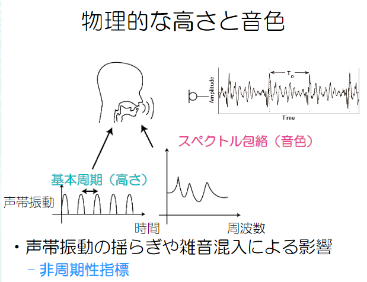

# 音響・音声処理 ～音声パラメータの推定法１～

明治大学総合数理学部
森勢 将雅（もりせ まさのり）

## 前半の内訳

- 音響・音声情報処理の概観
- 音声・音楽信号のディジタル表現
- 音声・音楽のスペクトル分析，スペクトログラム
- 音声分析合成，ソース・フィルタモデル
- 音声パラメータの推定法１（ソース情報）
- 音声パラメータの推定法２（フィルタ情報）
- 音声認識の基礎

## 前回の課題と解答

- 本日の講義では，Channel vocoderの波形生成において声帯振動をパルス列で近似する方法を説明した．パルス列で問題が無い理由を説明せよ．
  - スペクトル包絡には声帯振動のスペクトルが含まれているから

## 本日の課題

- 基本周波数推定法の性能評価は簡単とは言い難く，その中でも正解との差を求める単純な誤差計算は適切とは言えない．この理由を，エラーの種類をキーワードとして含めて簡潔に説明せよ．

## 物理的な高さと音色

[図: 声帯振動と基本周期、スペクトル包絡の関係を示す図]

- 声帯振動の揺らぎや雑音混入による影響

  - 非周期性指標

  

## ウィーナー=ヒンチンの定理

端的に言えば「パワースペクトル $|X(\omega)|^2$ の逆フーリエ変換が自己相関関数 $r(\tau)$ になる」という定理です。

$$
r(\tau) = \frac{1}{2\pi}\int_{-\infty}^{\infty}|X(\omega)|^2e^{j\omega \tau}d\omega
$$

証明してみましょう（制限時間10分）

- ヒント：フーリエ変換の公式等で複素共役に基づく関係性をいくつか利用します

まずはフーリエ変換と逆変換を定義します。

$X(\omega) = \int_{-\infty}^{\infty} x(t)e^{-j\omega t}dt$

$x(t) = \frac{1}{2\pi}\int_{-\infty}^{\infty} X(\omega)e^{j\omega t}d\omega$

逆変換時に $1/2\pi$ を乗じる形にします。

$$
\begin{align}
r(\tau) &= \int_{-\infty}^{\infty} x(t)x(t + \tau)dt \\
&= \int_{-\infty}^{\infty} x(t)\left(\frac{1}{2\pi}\int_{-\infty}^{\infty} e^{j\omega\tau}X(\omega)e^{j\omega t}d\omega\right) dt \\
&= \frac{1}{2\pi}\int_{-\infty}^{\infty} X(\omega)\left(\int_{-\infty}^{\infty} x(t)e^{j\omega t}dt\right) e^{j\omega\tau}d\omega \\
&= \frac{1}{2\pi}\int_{-\infty}^{\infty} X(\omega)X^*(\omega)e^{j\omega\tau}d\omega \\
&= \frac{1}{2\pi}\int_{-\infty}^{\infty} |X(\omega)|^2e^{j\omega\tau}d\omega
\end{align}
$$

ここでフーリエ変換の公式を利用し、負号が無い場合は複素共役となることを使いました。

## 自己相関の計算法

- $x(t)$：フーリエ変換すると
- $X(\omega)$：スペクトルが得られる．
- $|X(\omega)|$：振幅スペクトルを計算
- 振幅スペクトルを2乗して逆フーリエ変換すると，自己相関関数と一致する

## 自己相関法の問題

- $T_0$の代わりに$2T_0$をピークと誤検出
  - 本来の長さの倍（周波数が半分）であることから「ハーフピッチエラー」と呼ばれる
- 切り出す長さにより様々な誤差の要因に
- 改良案：相互相関法やYINなど

## ケプストラム法

- 基本周波数、スペクトル包絡推定の両方で利用される伝統的な方法
- 基本となるアイディアは「畳み込み演算を足し算に変換する」こと

$y(t) = x(t) * h(t)$

$Y(\omega) = X(\omega)H(\omega)$

$\log Y(\omega) = \log X(\omega) + \log H(\omega)$

$\log|Y(\omega)| = \log|X(\omega)| + \log|H(\omega)|$

フーリエ変換により畳み込みが積算に変換され、対数振幅は2つの要素の和となります。

## ケプストラム法の動作例

[図: ケプストラム法による処理例]

## その他の方法１

- 名前だけ出しますので，興味があったら調べてみてください（将来的なレポート課題に対する準備になるかも）
- 瞬時周波数を用いた方法
  - スペクトログラムにおける位相の時間方向の微分に相当するパラメータ
- Deep neural networkを用いた方法
  - DNNの中身はブラックボックスだがそこそこ動く（MATLABのpitchnn関数として公開）

## その他の方法２

- 最近は1つの特徴量（自己相関やケプストラムなど）ではなく，複数の特徴量を求めて接続する複数段階のアプローチが増えている
  - 自己相関法で問題のハーフピッチエラーは，そのエラーが生じない別の方法と組み合わせることで改善できる
- どの特徴量を選び，どのように接続するかがポイント．

## 基本周波数推定法の評価方法

[図: 基本周波数推定の評価方法の概要]

方法Aで推定し真値とする
方法Bで推定
差分から推定精度を計算

## 真値をどうやって得る？

- Electroglottography (EGG)信号の計測
  - 喉頭の左右に電極を装着し喉頭のインピーダンスの変化を計測した信号

[図: EGG信号と前進差分信号の例]

## いくつかの評価指標

- Gross pitch error (GPE)とFine pitch error (FPE)
  - GPEは，真値と推定値の差が1 ms以内ならば正解，そうでなければ不正解とみなし，全フレームに対するエラーフレームの比率
  - FPEは，GPEで正解と見なされたフレームについて誤差の平均と標準偏差を算出

極端に大きいエラーと微差を分けて評価

## もう1つの指標

- Gross error
  - 真値と推定値の誤差の比率が20%以内ならが正解，それ以外ならば不正解とし，全フレームに対する誤差フレームの比率で評価
  - GPE・FPEと比べると粗い評価ではある

## 基本周波数推定の現在

- DNNベースの方法が2010年代後半から提案されるようになってきた
- 自動採譜（ドかド#か区別できればOK）程度の精度ならばかなり高精度な推定が可能
- 音声の精密なF0軌跡を取り出す場合，DNNを使わない最先端の方法のほうが高精度

## 基本周波数推定のまとめ

- クリーンな音声を対象とした方法を紹介
- 最先端の推定法の精度は1%を争う水準
- 完璧な推定法は残念ながら未達成
  - 音声自体が完璧な周期を持っていないから

## ウィーナー=ヒンチンの定理（補足）

- 端的に言えば「パワースペクトル$|X(\omega)|^2$の逆フーリエ変換が自己相関関数$r(\tau)$になる」という定理
- $r(\tau) = \frac{1}{2\pi}\int_{-\infty}^{\infty}|X(\omega)|^2e^{j\omega t}d\omega$

## 定理の証明 by copilot

まずはフーリエ変換と逆変換を定義します。

$X(\omega) = \int_{-\infty}^{\infty} x(t)e^{-j\omega t}dt$

$x(t) = \frac{1}{2\pi}\int_{-\infty}^{\infty} X(\omega)e^{j\omega t}d\omega$

逆変換時に $ 1/2\pi$ を乗じる形にします。

## 証明２

自己相関関数 $r(	au)$ の定義です。信号 $x(t)$ と、時間 $\tau$ だけシフトした自身との類似度を表します。
$$
\begin{align}
r(\tau) &= \int_{-\infty}^{\infty} x(t)x(t + \tau)dt 
\end{align}
$$
$x(t+\tau)$ をその逆フーリエ変換表現で置き換えます。
$$
\begin{align}
&= \int_{-\infty}^{\infty} x(t)\\left(\\frac{1}{2\\pi}\\int_{-\infty}^{\infty} X(\\omega)e^{j\\omega (t + \\tau)}d\\omega\\right) dt
\end{align}
$$
積分の順序を変更し、$e^{j\\omega (t + \\tau)} = e^{j\\omega t}e^{j\\omega \\tau}$ を利用して $e^{j\\omega \\tau}$ を外側の積分に出します。
$$
\begin{align}
&= \\frac{1}{2\\pi}\\int_{-\infty}^{\infty} X(\\omega)e^{j\\omega \\tau}\\left(\\int_{-\infty}^{\infty} x(t)e^{j\\omega t}dt\\right) d\\omega
\end{align}
$$
内側の積分 $\\int_{-\\infty}^{\\infty} x(t)e^{j\\omega t}dt$ は、$X(\\omega)$ のフーリエ変換の定義 $X(\\omega) = \\int x(t)e^{-j\\omega t}dt$ と比較すると、指数 $e$ の肩の $j\\omega t$ の符号が逆になっています。これは $X(\\omega)$ の複素共役 $X^*(\\omega)$ を意味します。
$$
\begin{align}
&= \\frac{1}{2\\pi}\\int_{-\infty}^{\infty} X(\\omega)X^*(\\omega)e^{j\\omega \\tau}d\\omega
\end{align}
$$
最後に、$X(\\omega)X^*(\\omega) = |X(\\omega)|^2$ （ある複素数とその共役の積は、その複素数の絶対値の2乗に等しい）という関係を用いて式を整理します。これがウィーナー・ヒンチンの定理です。
$$
\begin{align}
&= \\frac{1}{2\\pi}\\int_{-\infty}^{\infty} |X(\\omega)|^2e^{j\\omega \\tau}d\\omega
\end{align}
$$

ここでフーリエ変換の公式を利用し、負号が無い場合は複素共役となることを使いました。
