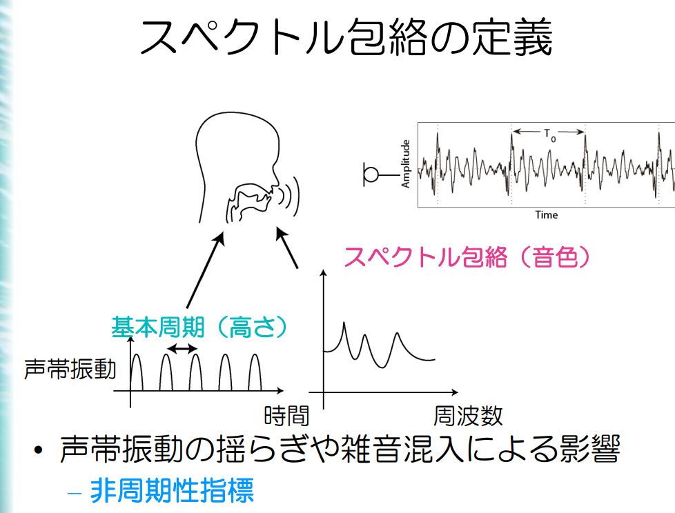
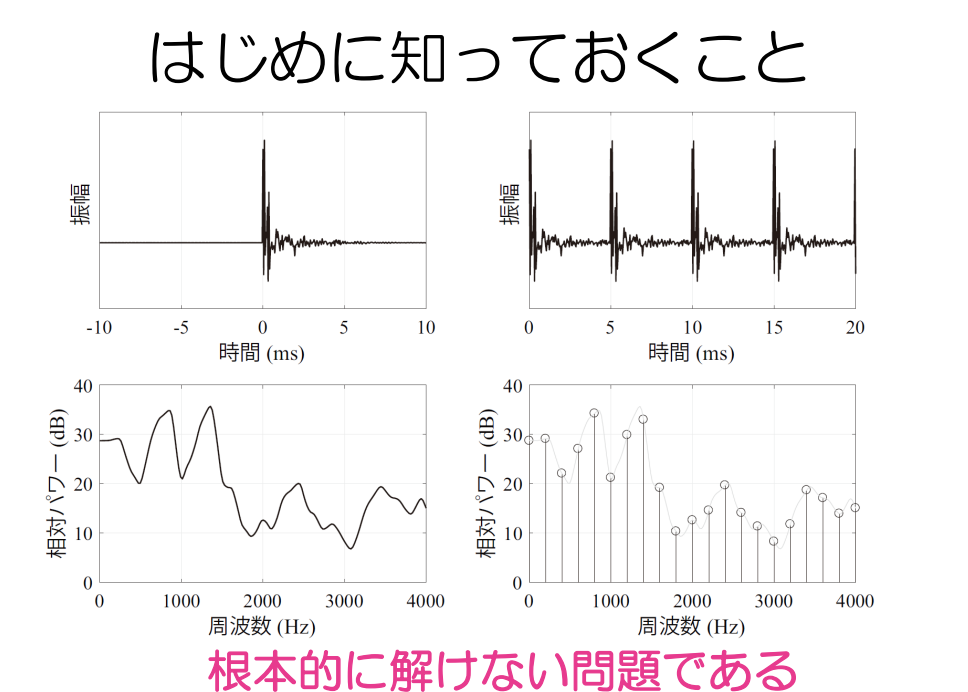
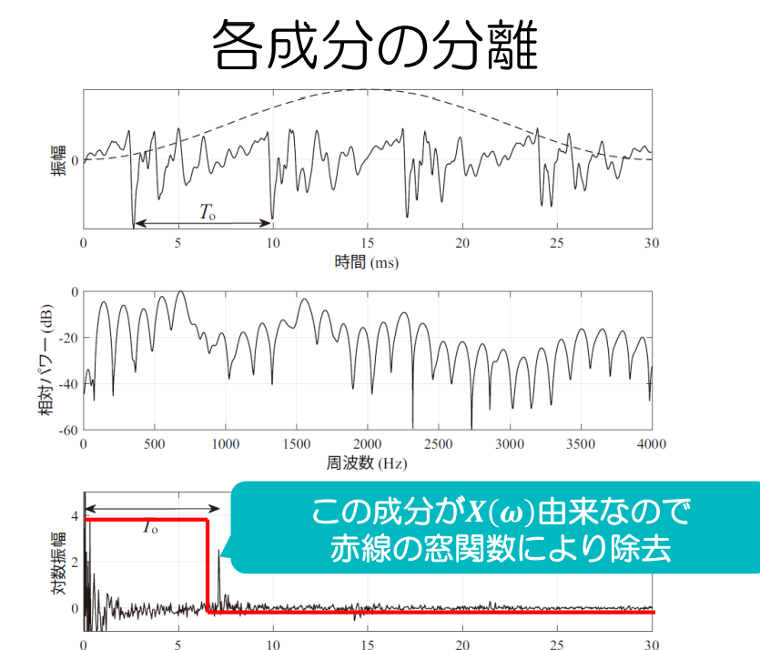
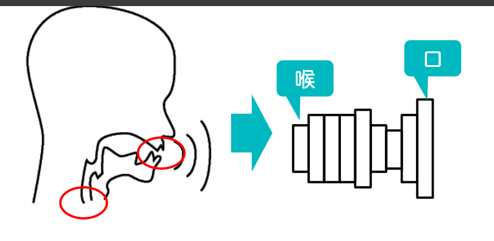
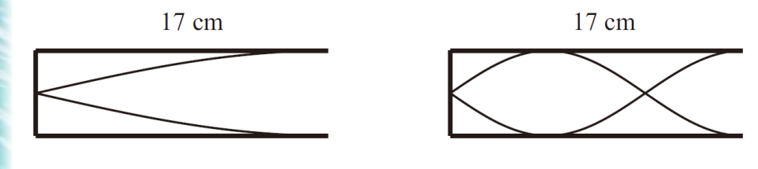
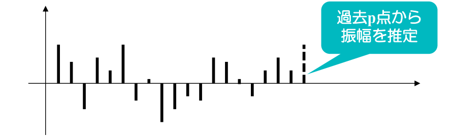

# 音響・音声処理～音声パラメータの推定法２～

**明治大学総合数理学部**  
**森勢 将雅（もりせ まさのり）**

## 目次

---

- スペクトル包絡の定義
- ノンパラメトリック推定法
- パラメトリック推定法
- 両推定の利点・欠点
- おわりに

## 前半の内訳

---

- 音響・音声情報処理の概観
- 音声・音楽信号のディジタル表現
- 音声・音楽のスペクトル分析，スペクトログラム
- 音声分析合成，ソース・フィルタモデル
- 音声パラメータの推定法１（ソース情報）
- **音声パラメータの推定法２（フィルタ情報）**
- 音声認識の基礎

## 前回の課題と解答

---

基本周波数推定法の性能評価は簡単とは言い難く，その中でも正解との差を求める単純な誤差計算は適切とは言えない．この理由を，エラーの種類をキーワードとして含めて簡潔に説明せよ．

**解答：** ハーフピッチエラーのように正解から大幅に異なるエラーが生じるため

## 本日の課題

---

スペクトル包絡推定法について，2種類のアプローチを紹介した．そのうちパラメトリック推定の代表的な方法を1つ挙げ，音声解析において何をモデル化しているかを述べよ．

## スペクトル包絡の定義

---

### 今回扱う問題の数式

---

$$y(t) = x(t) * h(t)$$

の状況で

$$y(t) \text{から} |H(\omega)| \text{を推定する問題}$$

- 推定対象は振幅（パワー）で位相は無視

推定のアプローチは2つ：

- パラメトリックな推定法
- ノンパラメトリックな推定法

**本講義では，代表的な方法を紹介**

### はじめに知っておくこと

---

**根本的に解けない問題である**

### 覚えておく数式（再掲）

---

$$x(t) = \sum_{n=-\infty}^{\infty} \delta(t - nT_0)$$

$$X(\omega) = \sum_{k=-\infty}^{\infty} \delta(\omega - k\omega_0)$$

$$y(t) = x(t) * h(t)$$

- 音声信号はパルス列とインパルス応答の畳み込みで表現される

$$Y(\omega) = X(\omega)H(\omega) \text{は，} H(\omega) \text{をパルス列化していると解釈できる．}$$

- [ ] 重要なのはまず、最初にナイキスト周波数など求められるところから作成すること。

### 解けない理由

---

アナログ信号をディジタル信号へ変換するAD変換の問題と同様：

- サンプリング周波数が $f_s$ Hzの場合，$f_s / 2$ Hz以上の成分は失われる．
- 元信号にその周波数成分がある場合，完全な信号の復元は不可能

$$Y(\omega) = X(\omega)H(\omega) \text{も} \omega_0 \text{ごとにスペクトルを離散化するAD変換と見なせる}$$

- スペクトルの急峻な変化は推定不可能

## ノンパラメトリックな推定法

---

### パラメトリックな推定法との違い

---

**パラメトリックな推定法**

- 推定に対し特定のモデルを仮定し，そのモデルのパラメータを推定する方法
- 例えば $y(t) = at^2 + bt + c$ というモデルで予測するとし，誤差が最小となる $a, b, c$ を推定する問題とする

**ノンパラメトリックな推定法**は，このようなモデルを仮定せずに推定する

### ケプストラム法

---

ノンパラメトリック推定の代表格

基本的な考えは基本周波数推定と同様：

$$Y(\omega) = X(\omega)H(\omega) \text{から}$$

$$\log|Y(\omega)| = \log|X(\omega)| + \log|H(\omega)|$$

を導き $\log|X(\omega)|$ の成分を分離すれば良い

# 

* 対数振幅を求めている。

- $\log 0 = -\infty$ になってしまうのでは？？
- 厳密な0にはならない。窓関数の効果があるため
- 実際には窓関数が必要です！
- $y(t) = x(t) * h(t)$ に $w(t)$（窓関数）をかけることで解決
- $Y(\omega) = (X(\omega) \cdot H(\omega)) \star W(\omega)$ となる（ここで $\star$ は畳み込み）

### 処理の数式

---

1. $y(t)$ から波形を切り出す（**長さ**の決定）
2. $\log|Y(\omega)|$ を逆FFTしてケプストラム算出
3. ケプストラム $c(\tau)$ に窓関数 $w(\tau)$ をかける（この処理を**リフタリング**という）
   - **リフタリングの設計**がもう1つのパラメータ
4. $c(\tau)w(\tau)$ をフーリエ変換して対数から線形に戻せば推定完了

### ケプストラムの問題

---

- 窓関数で切り出す波形の長さの設定
- リフタリングに使う窓関数
  - $X(\omega)$ に起因する成分を除去できることが条件
  - 高いF0と低いF0で同じ窓関数を利用すると主に低いF0の音声で問題が生じる

## パラメトリック推定

---

問題に対して何かのモデルを当てはめ，モデルを構成するパラメータを推定する方法

本講義では **線形予測分析（linear predictive coding: LPC）**    のみ紹介：

- 派生には**PARCORやLSP**（線スペクトル対）などがあり，特にLSPは世界中の携帯電話の符号化で利用された技術である．
- これらの技術の基本的な概念はLPCに詰まっているためLPCに対象を絞って説明

### 何をモデル化するか

---

- 筒をモデルとした理由は、物理の問題でやる閉管などで描かれている

**声帯位置から口元までを1本の筒と考える**

**断面積が変化する管を推定する問題**

### 管とスペクトルとの関係

---

閉管の共鳴周波数を求める問題：

- 17cmの管の最も低い共鳴周波数の波長は $17 \times 4 = 68$ cm
- 波長 $\lambda$ と周波数 $f$ の関係は：

$$f = \frac{c}{\lambda} \quad (c\text{は音速})$$

- $340 / 0.68$ は500，右図は1500 Hzとなる．

### 音響管による近似の意味

---

- 1つ1つの筒は共鳴周波数を持つ
- 筒1つをフィルタと見なすと，複数のフィルタを通す処理はフィルタの直列接続と等価

**結果としてスペクトルのピークを推定**

### 音響管の数学的考え方

---

基本的にはIIRフィルタによる近似が可能

つまり過去 $N$ 点の振幅に適当な係数を乗じて目的値の誤差を最小化する問題：

$$\hat{x}[n] = -\sum_{i=1}^{p} a_i x[n-i]$$

で定式化し，誤差を最小化する $a_i$ を計算

### LPC係数算出

---

これはかなり難しい（大学院レベルの内容を含む）ので，興味がある人は私の著書ですが「音声分析合成」を読んでください．

これをしっかり導出するレポートを書けるのであれば，かなりの高得点が期待できます．

### LPCの問題点

---

- IIRフィルタによる近似のためフィルタが発散するリスクが存在
  - LPCは必ず収束する係数を推定可能
  - 伝送時に誤差が入ると発散する危険性
- 誤差に対しても収束することを保証するための改良法：PARCORやLSP
- ピークを推定するため谷の存在が誤差を生む
  - 人間の音声は一般に5 kHz前後に谷が存在

### フィルタの発散について１

---

上記のようなシステムの場合，係数によっては発散（時間が経つごとに出力が無限に増え続ける）する．

IIRはInfinite Impulse Responseの略で，インパルス応答が無限長であるフィルタのことを示す．インパルス応答が有限なものはFIR (Finite Impulse response)フィルタ

### フィルタの発散について２

---

IIRフィルタは前スライドのように，出力が戻ってくるループ構造を持つがFIRフィルタはループ構造を持たない

- FIRフィルタは発散しない

## 両推定の利点・欠点

---

### 両手法の比較

---

**パラメトリック**

- **メリット**：モデルが現象を適切に表せていれば少数のパラメータで精度よく推定可能
- **デメリット**：適切に表現できるモデルが無ければ精度が頭打ちになる

**ノンパラメトリック**

- **メリット**：モデルに依存しないため，どのようなターゲットでも高精度な推定が理論上可能
- **デメリット**：パラメトリック表現と比べ推定結果を少数で表すことには向かない

### どういう用途に向いている？

---

**パラメトリック手法は音声符号化の用途に向いている．**

- 携帯電話などでは符号化しないと伝送することが難しいため

**ノンパラメトリック手法は高品質音声合成の用途に向いている．**

- 伝送を考えず品質を追求するため

**用途により一長一短**

### 高品質音声合成向けの最新法

---

高品質音声合成に向けた様々な改良

**切り出す時刻による差（真値は同一）**

### 実際の動きを観察してみる

---

切り出す時刻により結果が正弦波的に変化

$$|H(\omega)| = 1$$

**同一のものが変わることは望ましくない**

### 1つの解決法

---

2つの窓関数により変動成分を除去

**詳細は割愛するがうまくやれば綺麗に消せる**

## おわりに

---

### スペクトル包絡推定まとめ

---

かつてはSTRAIGHTとCheapTrickという2種が世界を席巻（現在はスペクトル包絡推定自体が下火）

どちらの方法も：

- 切り出す時刻に依存せず
- $\omega_0$ の整数倍の値は真値を満たし
- ある程度鋭いスペクトルを推定できる

条件を満たし，高品質音声合成の基盤を支えている
